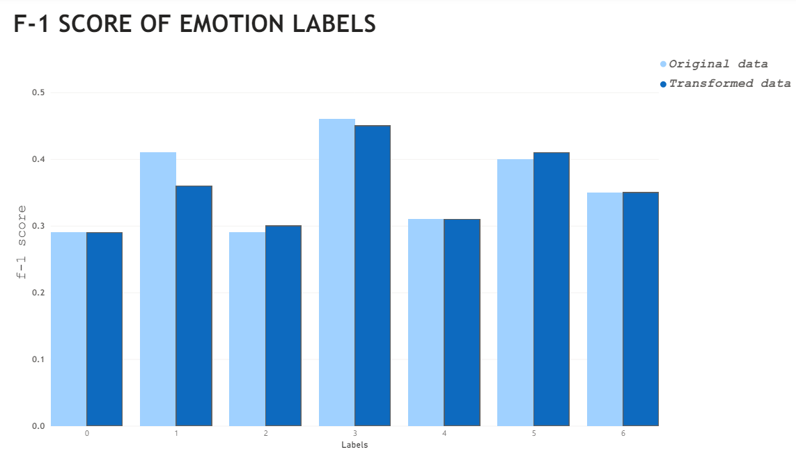

# Mini-Project for Fundamentals of Machine Learning Course

This repository contains the code and data for a mini-project on facial expression recognition using machine learning algorithms.

## 📑 Project Policy
- Team: group should consist of 3-4 students.

    |No.| Student Name    | Student ID |
    | --------| -------- | ------- |
    |1|Nguyễn Hoàng Yến Nhi|21110358|
    |2|Vũ Minh Như|21110360|
    |3|Phan Hồng Trâm|21110414|

- The submission deadline is strict: **11:59 PM** on **June 22nd, 2024**. Commits pushed after this deadline will not be considered.

## 📦 Project Structure

The repository is organized into the following directories:

- **/data**: This directory contains the facial expression dataset. You'll need to download the dataset and place it here before running the notebooks. (Download link provided below)
- **/notebooks**: This directory contains the Jupyter notebook ```EDA.ipynb```. This notebook guides you through exploratory data analysis (EDA) and classification tasks.

## ⚙️ Usage

This project is designed to be completed in the following steps:

1. **Fork the Project**: Click on the ```Fork``` button on the top right corner of this repository, this will create a copy of the repository in your own GitHub account. Complete the table at the top by entering your team member names.

2. **Download the Dataset**: Download the facial expression dataset from the following [link](https://mega.nz/file/foM2wDaa#GPGyspdUB2WV-fATL-ZvYj3i4FqgbVKyct413gxg3rE) and place it in the **/data** directory:

3. **Complete the Tasks**: Open the ```notebooks/EDA.ipynb``` notebook in your Jupyter Notebook environment. The notebook is designed to guide you through various tasks, including:
    
    1. Prerequisite
    2. Principle Component Analysis
       - [x] Question 1.
       - [x] Question 2.
    3. Image Classification
       - [x] MLP 
       - [x] Decision Tree
       - [x] kNN
       - [x] Naive Bayes
    4. Evaluating Classification Performance
    

    Make sure to run all the code cells in the ```EDA.ipynb``` notebook and ensure they produce output before committing and pushing your changes.

4. **Commit and Push Your Changes**: Once you've completed the tasks outlined in the notebook, commit your changes to your local repository and push them to your forked repository on GitHub.


Feel free to modify and extend the notebook to explore further aspects of the data and experiment with different algorithms. Good luck.

## 📋 REPORT OF PROJECT
Trong project trên, nhóm em sử dụng 4 model để huấn luyện dữ liệu, gồm: MLP Model, DecisionTree Classifier, KNeighbors Classifier và Naive Bayes model. Dựa vào Classification report và Confusion matrix, mô hình KNeighbors Classifier là mô hình tốt nhất và mô hình tệ nhất là Naive Bayes model. Kết luận dựa vào việc accuracy score và main score là F1 của model KNeighbors Classifier là cao nhất, ngược lại score của Naive Bayes là thấp nhất. 

|No.| Model    | Accuarary score of Original data|Accuarary score of transformed data|
| --------| -------- | ------- |------- |
|1|MLP model|0.35|0.36|
|2|Decision Tree model|0.30|0.24|
|3|kNN model|0.35|0.35|
|4|Naive Bayes model|0.20|0.33|



#### Sau khi chọn được best model là kNN, ta fit lại model trên tập test của original data và transformed data:
|No.| Score   | kNN model of Original data|kNN model of of transformed data|
| --------| -------- | ------- |------- |
|1|Accuaracy score|0.37|0.35|

#### Để nhận dạng xem biểu tượng cảm xúc nào là chính xác, hay rủi ro nhất, ta dựa theo điểm f1, do điểm f1 cung cấp một thước đo cân bằng giữa độ chính xác của các dự đoán dương tính và khả năng phát hiện ra trường hợp dương tính, vì vậy:
- The most accurate: cảm xúc mang nhãn số 3 "Happy".
- The most errors: cảm xúc mang nhãn số 0 "Angry".

## 💡 INTERESTING FINDINGS
Trong quá trình thực hiện huấn luyện model Decision tree, và khi thực hiện fine tuning mô hình của dữ liệu gốc, sẽ xuất hiện tình trạng làm mất đi hoàn toàn các đặc trưng thuộc nhãn số 1, tức là các điểm số như precision, recall và f-1 đều bằng 0.

**Nguyên nhân:**

**1. Imbalanced data:**
Do trong tập dữ liệu mẫu, các dữ liệu mang nhãn số 1 chỉ có 63 mẫu trong khi các dữ liệu thuộc các lớp khác có hơn 500 mẫu.

**2. Overfitting:**
Do mô hình quá phức tạp và chưa tối ưu hoá đúng bộ tham số dẫn đến cây quyết định chưa đủ sâu để phân tách các đặc trưng, nên nó có thể dẫn đến việc học của mô hình khớp với tập train một cách quá mức dẫn đến việc không tổng quát hoá tốt trên tập validation.

**Giải pháp:** Sử dụng các kỹ thuật Pruning để cắt tỉa bớt mô hình cây nhằm làm mô hình trở nên cô đặc và tối ưu hoá hơn.
1. Pre-pruning
2. Post-pruning
